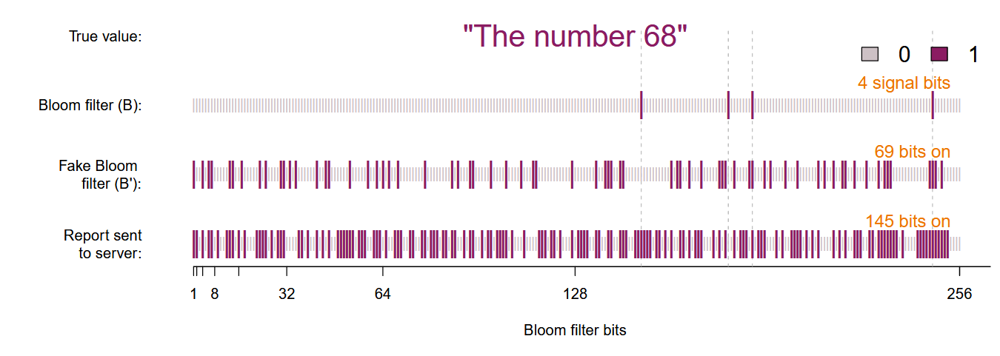
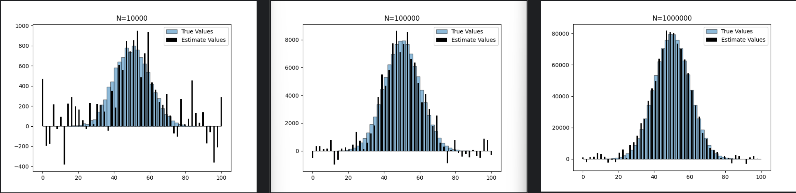

(2014, ACMCCS) RAPPOR
####################################

论文题目:
 `RAPPOR: Randomized Aggregatable Privacy-Preserving Ordinal Response\ <https://dl.acm.org/doi/abs/10.1145/2660267.2660348>`_

关键词：
 - Local Differential Privacy, **LDP**
 - Randomized Response, **RR**

一、算法概述
====================

RAPPOR是一种 **单值频数统计** （每个用户只发送一个变量取值，数据收集者根据已有的或统计得到的候选值列表，统计其中每一个候选值的频数并进行发布）的代表方法。
RAPPOR采用客户端（client）的真实值 :math:`v` ，按照一定方法以参数 :math:`k、h、f、p、q` 在本地执行以下步骤：

1.信号编码（Signal）
-------------------------

使用 :math:`h` 个哈希函数（hash functions）将客户端的值 :math:`v` 表示成一个长度为 :math:`k` 的向量 :math:`B` ，每一位都是 :math:`0` 或 :math:`1` .

2.永久性随机响应（Permanent randomized response, PRR）
---------------------------------------------------------------------------

对于每一个客户端的值 :math:`v` 和位 :math:`i (0 ≤ i < k \ in \ B)` ，生成一个二进制值 :math:`{B}_{i}^{'}` ，该值等于

.. math::

    {B}_{i}^{'}=
    \begin{cases}
    1,\quad {with\ probability}\ 0.5f \\
    0,\quad {with\ probability}\ 0.5f \\
    {B}_{i}, \quad{with\ probability}\ 1-f \\
    \end{cases}

其中 :math:`f` 是控制隐私级别的可调参数。
随后，这个 :math:`{B}^{'}` 被永久储存并固定，用作 :math:`v` 的报道值。

3.瞬时性随机响应（Instantaneous randomized response, IRR）
---------------------------------------------------------------------------

产生一个 :math:`k` 位数组 :math:`S` 并初始化每一位为 :math:`0` 。
以下面的概率设置  :math:`S` 中的每个位  :math:`i` ：

.. math::

    {P(S_i=1)}=
    \begin{cases}
    q,\quad if\ {B}_{i}^{'}=1 \\
    p,\quad if\ {B}_{i}^{'}=0 \\
    \end{cases}

4.报道（Report）
---------------------

将生成的 :math:`S` 发送到服务器（server）。

5.示例（Example）
---------------------

下图显示了 RAPPOR 算法的过程。
此处，客户端的值为 :math:`v = 68` ，布隆过滤器（Bloom filter）的大小为  :math:`k=256` ，哈希函数的数量为 :math:`h = 4` ，
可调随机响应参数为： :math:`p = 0.5, q = 0.75,f = 0.5` 。发送到服务器端的报告位数组显示在图的底部，可以看出 :math:`256` 位中的 :math:`145` 位被置 :math:`1` 。

在 :math:`B` （第二行） 中的 :math:`4` 个 Bloom filter 位中，有 :math:`2` 个传播到了 :math:`{B}^{'}` （第三位和第四位，如虚线所示）。
由于 :math:`{B}^{'}` 的永久性质，此用户端永远不会报告另外两个bit。
这意味着，通过来自该客户端的多个值（ “不同的” 68），攻击者最终可能会学习到 :math:`{B}^{'}` ，但很难继续推理通过差分隐私保护的 :math:`{B}` 的值。
在实践中，获得实际客户端的值 :math:`v` 甚至会更难，因为多个值可能会映射到 Bloom filter 中的相同位。

二、常见算法
====================

RAPPOR 算法可以通过多种方式进行修改，具体取决于需要隐私保护数据收集的场景的具体情况。
下面介绍三种常见的RAPPOR算法：

 - **One-time RAPPOR**：

  由客户端强制执行的一次性收集不需要纵向隐私保护。
  在这种情况下，可以跳过IRR步骤，并且对真实客户端的值进行直接随机化足以提供隐私保护。

 - **Basic RAPPOR**：

  如果要收集的字符串集（The set of strings）相对较小且定义明确，并且每个字符串都可以确定性地映射到位数组中的单个位，则无需使用具有多个哈希函数的 Bloom filter。
  例如，收集有关性别的数据可以简单地使用一个两位数组，其中 “male” 映射到第 1 位（10），“female” 映射到第 2 位（01）。
  
 - **Basic One-time RAPPOR**：

  这是 RAPPOR 最简单的形式，同时结合了前两个修改： 一轮随机化、使用字符串的确定性映射到唯一的位。

三、Python实现
====================

文章使用Basic One-time RAPPOR 模拟了学习平均值为 :math:`50` 和标准差 :math:`10` 的正态分布的形状（四舍五入为整数）。
隐私约束为： :math:`q = 0.75,p = 0.5,f = 0` 。代码结果显示了三种不同样本量的结果。

::

    import numpy as np
    import matplotlib.pyplot as plt
    import random

    N = 10000 # 样本数
    dim = 50 # 样本可取的值的数量

    samples_normal = np.random.normal(50, 10, N) # 生成正态分布随机数

    n,bins,patches = plt.hist(samples_normal, bins=dim, alpha=0.5,range=(0,100),edgecolor='black',label='True Values')

    one_hot_coding = np.eye(dim).tolist() #对dim个数创建one-hot编码

    coded_and_num = list(zip(one_hot_coding,n))
    coded_and_num_without0 = []
    for i in coded_and_num: # 去掉dim中没有数据的维度
        if i[1] != 0:
            coded_and_num_without0.append(i)

    rr_string_list = []
    for  bits, num in coded_and_num_without0:
        for i in range(0,int(num)):
            rr_string = ''
            for bit in bits:
                if bit == 1:
                    rr_bit = str(random.choices([1,0],[0.75,0.25])[0]) #q
                else:
                    rr_bit = str(random.choices([0,1],[0.5,0.5])[0]) #p
                rr_string += rr_bit
            rr_string_list.append(rr_string)

    c_i = [0]*dim

    for rr in rr_string_list:
        for i in range(0,len(rr)):
            c_i[i] = c_i[i] + int(rr[i])

    c_i_est = [ (c_i[i]-0.5 * N )/0.25 for i in range(len(c_i))]
    print(c_i_est)

    x = np.linspace(0,100,dim)
    plt.bar(x,c_i_est,label='Estimate Values', color='black')

    plt.legend()
    plt.show()

