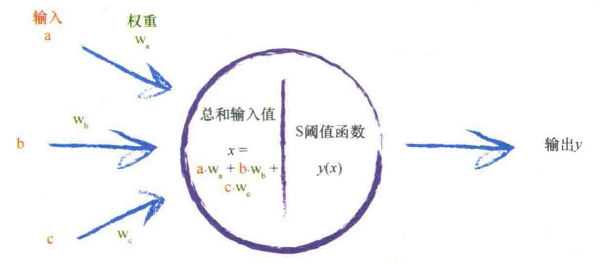
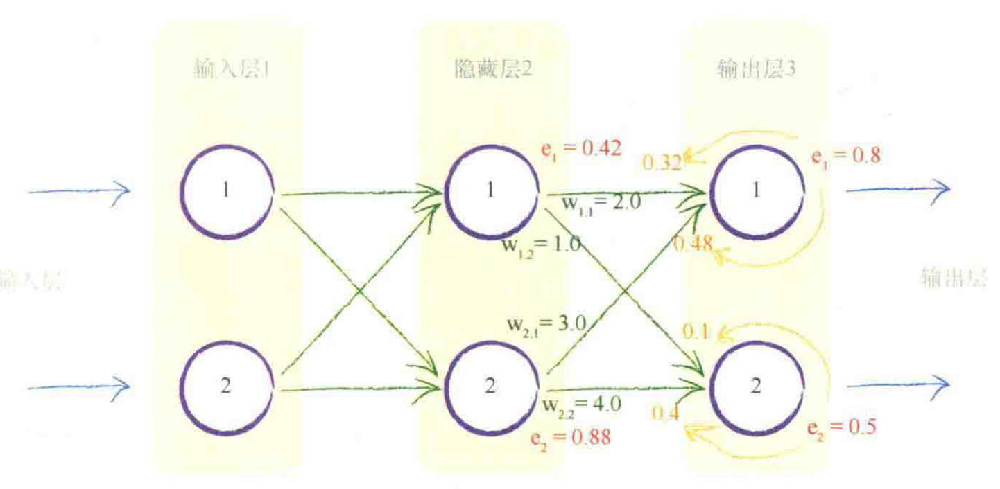
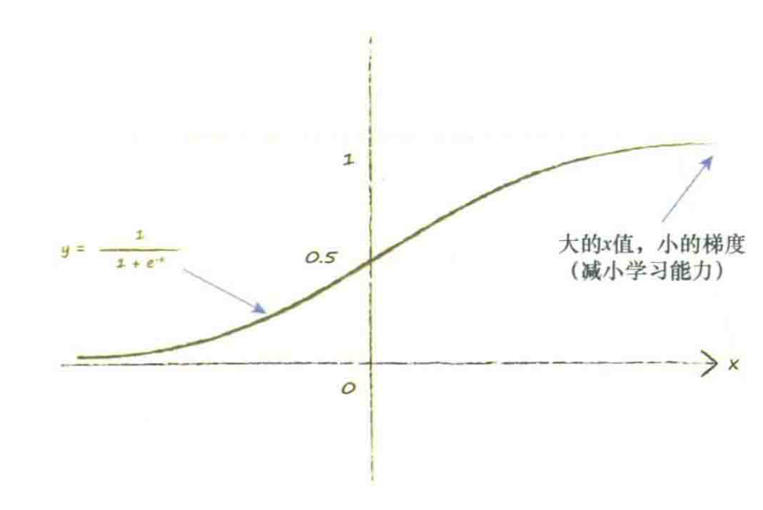

.. 

####################################
Python手搓神经网络
####################################

一个最普通的神经网络搭建大致可以分为以下几个部分：

一、输入的正向传播

二、误差的反向传播

三、误差函数的选择

四、使误差函数的值最小化

五、准备数据

一、输入的正向传播
====================

1、网络输入
----------------

在实际中，网络输入的数据种类繁多。按照维度主要有一维、二维（灰度图）、三维（RGB图片）。
同时为了充分利用计算机性能，每次进入网络训练的数据不止一组，而是一\ **批**\ （batch）。

2、正向传播
----------------
单个神经元向前传播的原理如下：

二、误差的反向传播
====================

三、误差函数的选择
====================

神经网络的输出是一个极其复杂困难的函数，这个函数具有许多参数影响到其输出的链接权重。
神经网络本身的输出函数不是一个误差函数。但由于误差是目标训练值与实际输出值之间的差值，
因此我们可以很容易地把输出函数变成误差函数。

误差函数的选择有很多，最简单的三种包括：:math:`目标值-实际值`、:math:`|目标值-实际值|`、
:math:`{|目标值-实际值|}^{2}` 

四、使误差函数的值最小化
======================

定义误差函数的梯度：

.. math::

    \frac{\partial E}{\partial {\omega}_{j,k}}

选择平方误差，则：

.. math::

    \frac{\partial E}{\partial {\omega}_{j,k}}=\frac{\partial}{\partial {\omega}_{j,k}}\sum_n{(t_n-o_n)}^2 

其中 :math:`n` 表示输出节点个数， :math:`t_n` 表示目标输出值， :math:`o_n` 表示实际输出值。

注意，在节点 :math:`n` 的输出 :math:`o` ，只取决于连接到这个节点的链接，
因此我们可以直接简化这个表达式。这意味着，由于这些权重是链接到节点 :math:`k` 的权重，
因此节点 :math:`k` 的输出 :math:`o_k` 只取决于权重 :math:`{\omega}_{j,k}` 。
换句话说，节点 :math:`k` 的输出不依赖于权重 :math:`{\omega}_{j,b}` ，
由于 :math:`b` 和 :math:`k` 之间没有链接，因此 :math:`b` 和 :math:`k` 无关联。
权重 :math:`{\omega}_{j,b}` 是连接输出节点b的链接权重，而不是输出节点k的链接权重。
这意味着，除了权重 :math:`{\omega}_{j,k}` 所链接的节点（也就是 :math:`o_k` ）外，
我们可以从和中删除所有的 :math:`o_n` ，得到：

.. math::

    \frac{\partial E}{\partial {\omega}_{j,k}}=\frac{\partial}{\partial {\omega}_{j,k}}{(t_k-o_k)}^2 

根据链式法则，又有：

.. math::

    \frac{\partial E}{\partial {\omega}_{j,k}}=\frac{\partial E}{\partial o_k}
    \times\frac{\partial o_k}{\partial {\omega}_{j,k}}
    =-2(t_k-o_k)\times\frac{\partial o_k}{\partial {\omega}_{j,k}}

针对第二项，如果选择sigmoid激活函数，则：

.. math::

    \frac{\partial o_k}{\partial {\omega}_{j,k}}
    =\frac{\partial}{\partial {\omega}_{j,k}}sigmoid(\sum_j{\omega}_{j,k}\times o_j)

其中 :math:`o_j` 是前一层的输出，则：

.. math::

    \frac{\partial E}{\partial {\omega}_{j,k}}

.. math::

    =-2(t_k-o_k)\times sigmoid(\sum_j{\omega}_{j,k}\times o_j)
     \times (1-sigmoid(\sum_j{\omega}_{j,k}\times o_j))
     \times \frac{\partial}{\partial {\omega}_{j,k}}(\sum_j{\omega}_{j,k}\times o_j))

:math:`\sum_j{\omega}_{j,k}\times o_j` 即为 :math:`o_k` ,最后一项很容易得到结果为 :math:`o_j` ，因此上式化简为：

.. math::

    =-2(t_k-o_k)\times sigmoid(o_k)
     \times (1-sigmoid(o_k))
     \times o_j

权重改变的方向与梯度相反（斜率为负说明需要增加权重的值），因此得到权重更新的公式：

.. math::

     {\omega}_{j,k}^{new} = {\omega}_{j,k}^{old} - \alpha \times \frac{\partial E}{\partial {\omega}_{j,k}}

五、准备数据
====================

1、输入
----------------

以sigmoid函数为例，可以发现如果输入变大，激活函数将会变得非常平坦。

由于我们使用梯度学习新的权重，因此一个平坦的激活函数会出问题。
权重的改变取决于激活函数的梯度，小梯度意味着限制神经网络学习的能力，
这就是所谓的\ **饱和神经网络**。这告诉我们应该尽量保持小的输入。

同时，我们也不应该让输入信号太小。当计算机处理非常小或非常大的数字时，可能会丧失精度，
因此，使用非常小的值也会出现问题。
一个好的建议是重新调整输入值，将其范围控制在0.0到1.0。输入0会将 :math:`o_j` 
设置为0，这样权重更新表达式就会等于0，从而造成学习能力的丧失，
因此在某些情况下可以将此输入加上一个小小的偏移，如0.01，避免输入0带来麻烦。

2、输出
----------------

神经网络的输出是最后一层节点输出的信号。 
**如果我们使用的激活函数不能生成大于1的值，那么尝试将训练目标值设置为比较大的值就有点愚蠢了。** 
如果我们将目标值设置在这些不可能达到的范围，训练网络将会驱使更大的权重，以获得越来越大的输出，
而这些输出实际上是不可能由激活函数生成的。这使得网络饱和，因此我们知道这种情况是很糟糕的。
应该重新调整目标值，匹配激活函数的可能输出，注意避开激活函数不可能达到的值。
虽然，常见的使用范围为0.0～1.0，但是由于0.0和1.0这两个数也不可能是目标值，并且有驱动产生过大的权重的风险，因此一些人也使用0.01 ～0.99的范围。

3、随机初始权重
----------------

与输入和输出一样，同样的道理也适用于初始权重的设置。由于大的初始权重会造成大的信号传递给激活函数，
导致网络饱和，从而降低网络学习到更好的权重的能力，因此应该避免大的初始权重值。
我们可以从一1.0～+1.0之间随机均匀地选择初始权重。比起使用非常大的范围，比如说-1000～+1000，
这是一个好得多的思路。

对于给定特定形状的网络以及特定的激活函数，数学家和计算机科学家曾进行过数学计算，
制定出了经验法则，设置了随机初始权重。数学家所得到的经验规则是：
**在一个节点传入链接数量平方根倒数的大致范围内随机采样，初始化权重。**
因此，如果每个节点具有3条传入链接，那么初始权重的范围应该在从 :math:`-1/ \sqrt{3}` 到 :math:`+1/\sqrt{3}` ，即士0.577之间。
如果每个节点具有100条传入链接，那么权重的范围应该在 :math:`-1/ \sqrt{100}` 到 :math:`+1/\sqrt{100}` ，即士0.1之间。
直觉上说，这是有意义的。一些过大的初始权重将会在偏置方向上偏置激活函数，非常大的权重将会使激活函数饱和。
一个节点的传入链接越多，就有越多的信号被叠加在一起。因此，如果链接更多，那么减小权重的范围，这个经验法则是有道理的。
从概率分布中进行采样的思想，那么这一经验法则实际上讲的是从均值为0、标准方差等于节点传入链接数量平方根倒数的正态分布中进行采样。

六、使用Python实现神经网络
==========================

一个基本的神经网络应当具有三种功能：初始化函数、训练、查询。

::

    import numpy as np
    import scipy.special  # 导入sigmoid函数

    class Neural_Network:

        # 初始化网络
        def __init__(self, ...):
            ....
            pass

        # 网络训练（计算输出、与实际输出对比指导网络权重更新）
        def train(self, ...):
            ....
            pass

        # 计算输出
        def query(self, ...):
            ....
            pass

假定神经网络一共有3层，每层的节点数量可变。

1、初始化函数
----------------

从初始化网络开始，我们需要设置输入层节点、隐藏层节点和输出层节点的数量。
这些节点数量定义了神经网络的形状和尺寸。这些数量并不固定，而是当我们使用参数创建一个新的神经网络对象时，才会确定这些数量。

::

    def __init__(self, input_nodes, hidden_nodes, output_nodes, learning_rate):
        # set number of nodes in each input, hidden, output layer
        self.inodes = input_nodes   # 输入层
        self.hnodes = hidden_nodes  # 隐藏层
        self.onodes = output_nodes  # 输出层
        self.lr = learning_rate     # 学习率

        # 简单生成初始化权重矩阵（-0.5到+0.5）
        self.s_wih = (np.random.rand(self.hnodes, self.inodes) - 0.5) 
        self.s_who = (np.random.rand(self.onodes, self.hnodes) - 0.5)
        # 简单生成初始化权重矩阵
        self.wih = np.random.normal(0.0, pow(self.hnodes, -0.5), (self.hnodes, self.inodes))
        self.who = np.random.normal(0.0, pow(self.onodes, -0.5), (self.onodes, self.hnodes))

        # 激活函数确定为sigmoid函数
        self.activation_function = lambda x: scipy.special.expit(x)  # 使用lambda创建函数
        pass

2、查询（正向传播）
---------------------
输入（相对于后一层而言，进入节点都可以称为输入）

.. math::
    X=\begin{pmatrix} x_1 \\  x_2 \\  x_3 \\ \cdots \\ x_{m-1} \\ x_m \end{pmatrix}\\

权重矩阵

.. math::
    W=
    \begin{pmatrix} 
    {\omega}_{11} & {\omega}_{21} & {\omega}_{31} & \cdots & {\omega}_{m1}\\
    {\omega}_{12} & {\omega}_{22} & {\omega}_{32} & \cdots & {\omega}_{m2}\\
    {\omega}_{13} & {\omega}_{23} & {\omega}_{33} & \cdots & {\omega}_{m3}\\
    {\omega}_{14} & {\omega}_{24} & {\omega}_{34} & \cdots & {\omega}_{m4}\\
    \cdots & \cdots & \cdots & \cdots & \cdots\\
    {\omega}_{1n} & {\omega}_{2n} & {\omega}_{3n} & \cdots & {\omega}_{mn}\\
    \end{pmatrix}

则输出

.. math::
    Y=f(W \cdot X)=sigmoid(W \cdot X)
    
.. note::
    输入 :math:`X` 既可以是行向量也可以是列向量，区别在于矩阵相乘的顺序（WX或XW）和权重矩阵的排列不同。

::

    def query(self, inputs_list):
        # 将列表输入变成数组
        inputs = np.array(inputs_list, ndmin=2).T

        # 输入层到隐藏层
        hidden_inputs = np.dot(self.wih, inputs)

        # 隐藏层通过激活函数输出
        hidden_outputs = self.activation_function(hidden_inputs)

        # 隐藏层到输出层 
        final_inputs = np.dot(self.who, hidden_outputs)

        # 输出层通过激活函数输出
        final_outputs = self.activation_function(final_inputs)

        return final_outputs

3、训练（误差反向传播）
--------------------------

.. image:: img/error_fun.jpeg
    :scale: 50%     
    :align: center

::

    def train(self, inputs_list, targets_list):
        # 将列表输入变成数组
        inputs = np.array(inputs_list, ndmin=2).T
        targets = np.array(targets_list, ndmin=2).T

        # 计算进入隐藏层的输入
        hidden_inputs = np.dot(self.wih, inputs)

        # 激活函数计算隐藏层输出
        hidden_outputs = self.activation_function(hidden_inputs)

        # 计算进入输出层的输入
        final_inputs = np.dot(self.who, hidden_outputs)

        # 激活函数计算输出层输出
        final_outputs = self.activation_function(final_inputs)

        # 计算误差 e = target - actual
        output_errors = targets - final_outputs

        # 计算反向传播误差
        hidden_errors = np.dot(self.who.T, output_errors)

        # 更新隐藏层和输出层的权重
        self.who += self.lr * np.dot((output_errors * final_outputs * (1.0 - final_outputs)), np.transpose(hidden_outputs))

        # 更新输入层和隐藏层的权重
        self.wih += self.lr * np.dot((hidden_errors * hidden_outputs * (1.0 - hidden_outputs)), np.transpose(inputs))
        pass

4、实例：MINIST数据集
--------------------------

::

    # load the mnist training data CSV file into a list
    training_data_file = open(MINIST训练集数据路径, 'r')
    training_data_list = training_data_file.readlines()
    training_data_file.close()

    # number of input, hidden and output nodes
    input_nodes = 784
    hidden_nodes = 200
    output_nodes = 10

    # learning rate
    learning_rate = 0.1

    # create instance of neural network
    n = Neural_Network(input_nodes, hidden_nodes, output_nodes, learning_rate)

    # train the neural network
    epochs = 50

    for e in range(epochs):
        # go through all records in the training data set
        print("Training..." + 'epochs:' + str(e))
        for record in training_data_list:
            # split the record by the ',' commas
            all_values = record.split(',')
            # scale and shift the inputs
            inputs = (np.asfarray(all_values[1:]) / 255.0 * 0.99) + 0.01
            # create the target output values (all 0.01, except the desired label which is 0.99)
            targets = np.zeros(output_nodes) + 0.01
            # all_values[0] is the target label for this record
            targets[int(all_values[0])] = 0.99
            n.train(inputs, targets)
            pass
        pass

    # test the neural network

    # scorecard for how well the network performs, initially empty
    scorecard = []

    # load the mnist test data CSV file into a list
    test_data_file = open(MINIST测试集数据路径, 'r')
    test_data_list = test_data_file.readlines()
    test_data_file.close()

    # go through all the records in the test data set
    for record in test_data_list:
        # split the record by the ',' commas
        all_values = record.split(',')
        # correct answer is first value
        correct_label = int(all_values[0])
        # scale and shift the inputs
        inputs = (np.asfarray(all_values[1:]) / 255.0 * 0.99) + 0.01
        # query the network
        outputs = n.query(inputs)
        # the index of the highest value corresponds to the label
        label = np.argmax(outputs)
        # append correct or incorrect to list
        if label == correct_label:
            # network's answer matches correct answer, add 1 to scorecard
            scorecard.append(1)
        else:
            # network's answer doesn't match correct answer, add 0 to scorecard
            scorecard.append(0)
            pass

        pass

    # calculate the performance score, the fraction of correct answers
    scorecard_array = np.asarray(scorecard)
    print("performance = ", scorecard_array.sum() / scorecard_array.size)
